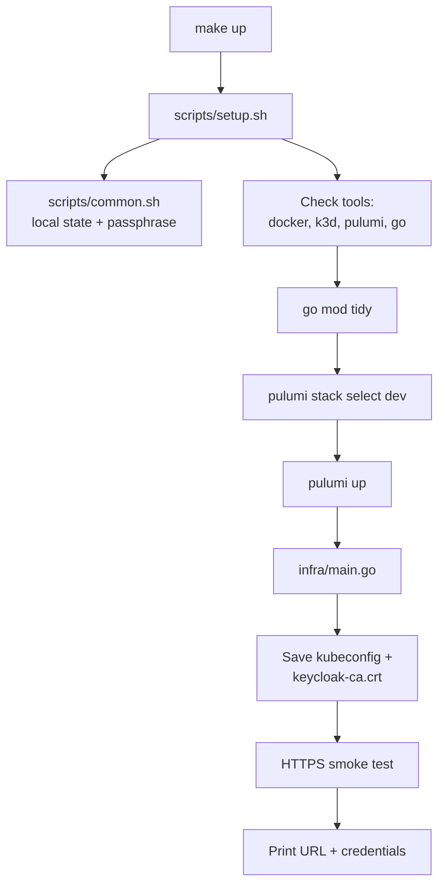
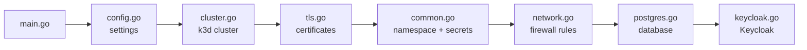
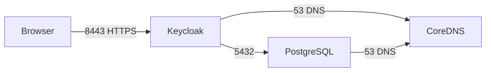

# Keycloak on a local Rancher (k3s) cluster — Pulumi + Go

A fully automated, reproducible setup that:

1. creates a local **Rancher k3s** Kubernetes cluster (via **k3d**, inside Docker),
2. deploys a **hardened Keycloak** backed by **PostgreSQL**,
3. serves Keycloak over **HTTPS only**, with minimal network exposure,

using **Pulumi with Go** as the single Infrastructure-as-Code tool, including the cluster itself.

Everything comes up with **one command**:

```bash
make up
```

---

## Table of contents

1. [Quick start](#1-quick-start)
2. [Keycloak credentials](#2-keycloak-credentials)
3. [Prerequisites](#3-prerequisites)
4. [Architecture](#4-architecture)
5. [Full flow: what happens when you run `make up`](#5-full-flow-what-happens-when-you-run-make-up)
6. [Repository layout](#6-repository-layout)
7. [The Makefile](#7-the-makefile)
8. [The `scripts/` folder](#8-the-scripts-folder)
9. [The `infra/` folder (Pulumi program in Go)](#9-the-infra-folder-pulumi-program-in-go)
10. [Pulumi state: how Pulumi remembers what it built](#10-pulumi-state-how-pulumi-remembers-what-it-built)
11. [Where are the Kubernetes manifests?](#11-where-are-the-kubernetes-manifests)
12. [Security and hardening](#12-security-and-hardening)
13. [Configuration](#13-configuration)
14. [Verification](#14-verification)
15. [Teardown](#15-teardown)
16. [Troubleshooting](#16-troubleshooting)
17. [Assumptions](#17-assumptions)
18. [Possible improvements](#18-possible-improvements)
19. [Time spent](#19-time-spent)
20. [O/P_Screenshots](#20-o/p-screenshot)

---

## 1. Quick start

```bash
git clone https://github.com/sharonbiju1996/IAC-with-pulumi-for-rancher.git
cd IAC-with-pulumi-for-rancher
make up
```

The first run takes about **3–6 minutes** (it downloads container images). At the end it prints:

```
  Keycloak admin console : https://keycloak.localtest.me:8443/admin/
  Username               : admin
  Password               : <randomly generated>
```

Open **https://keycloak.localtest.me:8443/admin/** and log in.

> `localtest.me` is a public DNS name whose subdomains all point to `127.0.0.1` (your own machine), so no hosts-file edits are needed.

---

## 2. Keycloak credentials

| Field | Value |
|---|---|
| Admin console | https://keycloak.localtest.me:8443/admin/ |
| Realm | `master` |
| Username | `admin` |
| Password | Randomly generated at deploy time. Printed at the end of `make up`, and at any time with `make credentials` |

The password is **intentionally not written in this repository**. Committing credentials to Git would contradict the security requirements of the task. It is generated by Pulumi, stored encrypted in the Pulumi state, and placed in the Kubernetes Secret `keycloak/keycloak-admin`.

**To choose your own password instead:**

```bash
KEYCLOAK_ADMIN_PASSWORD='Choose-A-Strong-One-123!' make up
```

**Browser notes:**

- The browser shows **"Not secure"** because the certificate is signed by a private CA that Pulumi creates. The connection **is encrypted**. To remove the warning, import `keycloak-ca.crt` as a trusted certificate (see [Trusting the certificate](#trusting-the-certificate)).
- Keycloak 26 labels the first admin account as **"temporary"** and shows a yellow banner. It is fully functional for this local setup. In production you would create a permanent admin and delete the bootstrap one.

---

## 3. Prerequisites

| Tool | Tested version | Purpose |
|---|---|---|
| Docker | 24+ | Runs the k3s cluster as containers |
| k3d | 5.6+ (tested 5.9.0) | Creates Rancher k3s clusters inside Docker |
| Pulumi CLI | 3.x (tested 3.263.0) | Runs the IaC program |
| Go | 1.22+ | Language of the Pulumi program |
| kubectl | 1.29+ | Optional, for inspection only |
| make, curl | any | Run the Makefile and the smoke test |

**Install commands (Ubuntu / WSL2):**

```bash
# Docker
sudo apt update && sudo apt install -y docker.io make curl
sudo usermod -aG docker $USER      # then log out and back in

# k3d
curl -s https://raw.githubusercontent.com/k3d-io/k3d/main/install.sh | bash

# Pulumi
curl -fsSL https://get.pulumi.com | sh

# Go: download from https://go.dev/dl/ and add /usr/local/go/bin to PATH

# kubectl (optional)
curl -LO "https://dl.k8s.io/release/$(curl -Ls https://dl.k8s.io/release/stable.txt)/bin/linux/amd64/kubectl"
sudo install kubectl /usr/local/bin/kubectl
```

**Resources:** about 2 CPU cores and 3 GB RAM free for Docker. Host ports **8443** and **6550** must be free (both configurable).

**No Pulumi Cloud account is needed.** The scripts store Pulumi state in a local folder and generate a random passphrase to encrypt secrets.

**Tested on:** Windows 11 with WSL2 (Ubuntu). Should also work on Linux and macOS.

---

## 4. Architecture

```
 Your machine
 ─────────────────────────────────────────────────────────────────────
  Browser ──HTTPS──▶ 127.0.0.1:8443          kubectl ──▶ 127.0.0.1:6550
                          │                                  │
 ┌────────────────────────┼──── k3d (Docker) ────────────────┼────────┐
 │  k3d load balancer :443│                         k3s API server    │
 │                        ▼                                           │
 │  Service "keycloak" (LoadBalancer, port 443 only)                  │
 │                        │                                           │
 │   namespace: keycloak  │  PodSecurity = restricted, default-deny   │
 │   ┌────────────────────▼───────┐   5432/tcp   ┌─────────────────┐  │
 │   │ Keycloak (production mode) │ ───────────▶ │ PostgreSQL 16   │  │
 │   │ :8443 HTTPS  :9000 health  │  (NetPol)    │ StatefulSet+PVC │  │
 │   └────────────────────────────┘              └─────────────────┘  │
 └────────────────────────────────────────────────────────────────────┘
```

**Key design choices:**

- **Only two host ports**, both bound to `127.0.0.1`: `8443` (Keycloak) and `6550` (Kubernetes API). Nothing is reachable from the local network.
- **No Ingress controller.** k3s's built-in Traefik is disabled. Keycloak serves TLS itself, so traffic is encrypted all the way to the pod, and there is one less component to attack.
- **PostgreSQL** instead of Keycloak's built-in development database, with a persistent 2 GB disk.
- **Default-deny network policies**: only three traffic paths are allowed.

---

## 5. Full flow: what happens when you run `make up`



**Step by step:**

| # | What happens | Where |
|---|---|---|
| 1 | You type `make up` | `Makefile` |
| 2 | Make runs `./scripts/setup.sh` | `Makefile` |
| 3 | `setup.sh` loads shared settings: local state folder, stack name `dev`, passphrase | `scripts/common.sh` |
| 4 | Checks that `docker`, `k3d`, `pulumi`, `go` are installed and Docker is running | `scripts/setup.sh` |
| 5 | Downloads Go libraries (`go mod tidy`) | `scripts/setup.sh` |
| 6 | Selects (or creates) the Pulumi stack `dev` | `scripts/setup.sh` |
| 7 | Runs `pulumi up`, which compiles and runs the Go program | `scripts/setup.sh` |
| 8 | The Go program creates everything, in order (below) | `infra/*.go` |
| 9 | Saves `kubeconfig` and `keycloak-ca.crt` to the repo root (both git-ignored) | `scripts/setup.sh` |
| 10 | Calls Keycloak over HTTPS, verifying the certificate, up to 30 times | `scripts/setup.sh` |
| 11 | Prints the URL, username and password | `scripts/setup.sh` |

**Inside `pulumi up` (step 8), the Go program runs in this order:**



| Order | Function | File | Creates |
|---|---|---|---|
| 0 | `loadConfig` | `config.go` | Reads settings, fills in defaults |
| 1 | `newCluster` | `cluster.go` | k3d cluster (2 Docker containers) + kubeconfig |
| 2 | `kubernetes.NewProvider` | `main.go` | Connection to the new cluster |
| 3 | `newCertificates` | `tls.go` | Private CA + Keycloak certificate |
| 4 | `newNamespace` | `common.go` | Namespace `keycloak` (restricted) |
| 5 | `newSecrets` | `common.go` | Random passwords + 3 Kubernetes Secrets |
| 6 | `newNetworkPolicies` | `network.go` | 4 NetworkPolicies |
| 7 | `newPostgres` | `postgres.go` | PostgreSQL StatefulSet + Service + disk |
| 8 | `newKeycloak` | `keycloak.go` | Keycloak Deployment + LoadBalancer Service |
| 9 | `ctx.Export` | `main.go` | Saves URL, username, password, CA, kubeconfig as outputs |

**How data flows between the functions.** Each function's output becomes the next one's input:

```
loadConfig(ctx)                               → cfg
newCluster(ctx, cfg)                          → cluster
NewProvider(cluster.Kubeconfig)               → k8s → opts
newCertificates(ctx, cfg)                     → certs
newNamespace(ctx, cfg, opts)                  → ns
newSecrets(ctx, cfg, ns, certs, opts)         → secrets
newNetworkPolicies(ctx, ns, opts)             → (error only)
newPostgres(ctx, cfg, ns, secrets, opts)      → pg
newKeycloak(ctx, cfg, ns, secrets, pg, opts)  → (error only)
```

Passing `pg` into `newKeycloak` makes Pulumi wait until the database is ready before starting Keycloak.

**Running `make up` again is safe (idempotent).** Pulumi compares the code with its saved state and only changes what is different. If nothing changed, nothing happens.

---

## 6. Repository layout

```
.
├── Makefile                 # short commands: up / down / purge / credentials / status
├── README.md                # this file
├── .gitignore               # keeps state, secrets and generated files out of Git
├── scripts/
│   ├── common.sh            # shared settings: local Pulumi backend, passphrase, stack name
│   ├── setup.sh             # checks → pulumi up → save files → smoke test → print login
│   ├── credentials.sh       # prints URL + admin credentials from Pulumi outputs
│   └── teardown.sh          # pulumi destroy (+ k3d fallback); PURGE=true wipes state
└── infra/                   # the Pulumi program (Go)
    ├── Pulumi.yaml          # project name + runtime (go)
    ├── go.mod / go.sum      # Go dependencies, pinned versions
    ├── main.go              # entry point: calls every step in order, exports outputs
    ├── config.go            # all settings with safe defaults
    ├── cluster.go           # k3d/k3s cluster via pulumi-command
    ├── tls.go               # private CA + server certificate via pulumi-tls
    ├── common.go            # namespace, passwords, secrets, service accounts, helpers
    ├── network.go           # 4 NetworkPolicies (default deny)
    ├── postgres.go          # PostgreSQL StatefulSet + ClusterIP Service
    └── keycloak.go          # Keycloak Deployment + LoadBalancer Service
```

**Files created at runtime (never committed, listed in `.gitignore`):**

| File / folder | Content |
|---|---|
| `.pulumi-state/` | Pulumi state + passphrase (see [section 10](#10-pulumi-state-how-pulumi-remembers-what-it-built)) |
| `kubeconfig` | Access file for the cluster (permission 600) |
| `keycloak-ca.crt` | Public CA certificate, to trust in your browser |
| `infra/Pulumi.dev.yaml` | Stack settings + encryption salt |
| `infra/infra` | Compiled Go binary |

---

## 7. The Makefile

The Makefile gives short names to the scripts:

```makefile
up:           ## Provision cluster + deploy Keycloak
	./scripts/setup.sh
down:         ## Destroy everything (keeps local state)
	./scripts/teardown.sh
purge:        ## Destroy everything and delete local Pulumi state
	PURGE=true ./scripts/teardown.sh
credentials:  ## Print Keycloak admin URL and credentials
	./scripts/credentials.sh
status:       ## Show pods, services, network policies
	kubectl --kubeconfig kubeconfig -n keycloak get pods,svc,pvc,networkpolicy
```

| Command | What it does |
|---|---|
| `make up` | Creates the cluster and deploys everything |
| `make credentials` | Shows the URL, username and password again |
| `make status` | Shows pods, services, disks and network policies |
| `make down` | Deletes Keycloak, Postgres and the cluster (keeps Pulumi state) |
| `make purge` | Same as `down`, plus deletes the state, passphrase, kubeconfig and CA file |

`make` must be run from the repository root, where the `Makefile` is.

---

## 8. The `scripts/` folder

The scripts wrap Pulumi so the reviewer needs only one command. All of them start by loading `common.sh`.

### `scripts/common.sh` — shared settings

| What it does | Why |
|---|---|
| `set -euo pipefail` | Stop immediately on any error |
| Finds `ROOT_DIR`, `INFRA_DIR`, `STATE_DIR` | Scripts work from any folder |
| `STACK="${STACK:-dev}"` | Stack name is `dev` unless you set `STACK=...` |
| `PULUMI_BACKEND_URL=file://.pulumi-state` | Pulumi saves its state **locally**, no Pulumi Cloud login needed |
| Creates `.pulumi-state/.passphrase` once (32 random bytes, permission 600) | Pulumi uses it to **encrypt secrets** in the state |
| `PULUMI_CONFIG_PASSPHRASE_FILE` | Points Pulumi at that passphrase file |
| `log`, `warn`, `die` | Coloured messages (blue info, yellow warning, red error) |

You can override the backend, for example to use Pulumi Cloud or S3:

```bash
PULUMI_BACKEND_URL=https://api.pulumi.com make up
```

### `scripts/setup.sh` — build everything (`make up`)

1. Loads `common.sh`.
2. Checks that `docker`, `k3d`, `pulumi`, `go` exist and Docker is running.
3. `go mod tidy`: downloads the Go libraries.
4. `pulumi stack select dev --create`: selects the stack, creating it the first time.
5. If `KEYCLOAK_ADMIN_PASSWORD` is set, saves it as an encrypted Pulumi secret.
6. `pulumi up --yes`: runs the Go program and creates everything.
7. Writes `keycloak-ca.crt` and `kubeconfig` from the stack outputs.
8. **Smoke test:** calls `https://keycloak.localtest.me:8443/realms/master/.well-known/openid-configuration` with `curl --cacert keycloak-ca.crt`, up to 30 times, 5 seconds apart. Success proves Keycloak works end to end over **verified** HTTPS.
9. Prints the URL, username and password.

### `scripts/credentials.sh` — show the login (`make credentials`)

Reads the saved Pulumi outputs `adminConsoleUrl`, `adminUsername` and `adminPassword` (with `--show-secrets`) and prints them.

### `scripts/teardown.sh` — delete everything (`make down` / `make purge`)

1. `pulumi destroy --yes`: deletes every resource Pulumi created, including the cluster.
2. Safety net: if the k3d cluster still exists, deletes it with `k3d cluster delete`.
3. Only with `PURGE=true` (`make purge`): removes the stack and deletes `.pulumi-state/`, `kubeconfig` and `keycloak-ca.crt`.

---

## 9. The `infra/` folder (Pulumi program in Go)

All 8 Go files use `package main`, so they can call each other's functions. `main.go` is the only one that runs by itself; it calls the others in order.

### How to read the code

Every Pulumi resource in this project follows the same shape:

```go
thing, err := package.NewThing(ctx, "pulumi-name", &package.ThingArgs{
    Field: pulumi.String("value"),
}, opts...)
if err != nil {
    return err
}
```

| Part | Meaning |
|---|---|
| `package.NewThing` | What to create (Namespace, Secret, Service…) |
| `ctx` | Pulumi's context, always first |
| `"pulumi-name"` | Pulumi's own name for the resource (used in the state) |
| `&package.ThingArgs{...}` | The resource's settings |
| `pulumi.String(...)` | Pulumi's wrapper around normal values so it can track them |
| `opts...` | Options, e.g. "create this in our cluster" |
| `if err != nil { return err }` | If it failed, stop and report the error |

### `Pulumi.yaml` — project definition

```yaml
name: keycloak-local
runtime: go
```

Tells Pulumi the project name and that the program is written in Go.

### `go.mod` / `go.sum` — dependencies

Lists the Pulumi libraries used, at pinned versions:

| Library | Used for |
|---|---|
| `pulumi/sdk/v3` | Pulumi core |
| `pulumi-command` | Running the `k3d` command |
| `pulumi-kubernetes/sdk/v4` | All Kubernetes objects |
| `pulumi-tls/sdk/v5` | Keys and certificates |
| `pulumi-random/sdk/v4` | Random passwords |

`go.sum` records exact checksums so every build uses identical versions.

### `main.go` — the entry point

```go
func main() {
    pulumi.Run(func(ctx *pulumi.Context) error { ... })
}
```

- Go always starts at `func main()`. `pulumi.Run` hands control to Pulumi.
- Calls every step in order (see the table in [section 5](#5-full-flow-what-happens-when-you-run-make-up)).
- Creates a **Kubernetes provider** from the new cluster's kubeconfig, and passes it to every Kubernetes resource through `opts`. This guarantees everything is created in **this** cluster and nowhere else.
- **Exports** the results with `ctx.Export`: `keycloakUrl`, `adminConsoleUrl`, `adminUsername`, `adminPassword` (secret), `caCertificate`, `kubeconfig` (secret). The scripts read these outputs.

### `config.go` — settings with defaults

- `type Config struct` defines every setting (cluster name, ports, hostname, images, admin user).
- `loadConfig(ctx)` reads each value from Pulumi config, or uses a safe default. So `pulumi up` works with zero configuration.
- If an `adminPassword` secret is set, it is used. Otherwise `common.go` generates a random one.

See [section 13](#13-configuration) for all settings.

### `cluster.go` — the Kubernetes cluster

Uses `pulumi-command` to run the k3d command:

```bash
k3d cluster create keycloak \
  --image rancher/k3s:v1.31.5-k3s1 --servers 1 --agents 0 \
  --api-port 127.0.0.1:6550 \
  --port "127.0.0.1:8443:443@loadbalancer" \
  --k3s-arg "--disable=traefik@server:0" \
  --kubeconfig-update-default=false --kubeconfig-switch-context=false \
  --wait --timeout 300s
```

| Flag | Meaning |
|---|---|
| `k3d cluster list ... \|\|` | Skip creation if the cluster already exists (safe re-runs) |
| `--image rancher/k3s:v1.31.5-k3s1` | Pinned k3s version for reproducibility |
| `--servers 1 --agents 0` | Single node, enough for local use |
| `--api-port 127.0.0.1:6550` | Kubernetes API reachable **only from this machine** |
| `--port "127.0.0.1:8443:443@loadbalancer"` | Host port 8443 → cluster port 443, localhost only |
| `--disable=traefik` | No ingress controller (Keycloak handles TLS) |
| `--kubeconfig-update-default=false` | Doesn't touch your personal `~/.kube/config` |
| `--wait --timeout 300s` | Waits up to 5 minutes for the cluster |

- `Create` runs on `make up`; `Delete` (`k3d cluster delete keycloak`) runs on `make down`.
- A second command, `k3d kubeconfig get keycloak`, reads the cluster's access file. Its output is marked **secret**, so it is encrypted in the state.

### `tls.go` — HTTPS certificates

Creates a private certificate authority, then a certificate for Keycloak signed by it:

| Step | Pulumi resource | Result |
|---|---|---|
| 1 | `tls.NewPrivateKey` | CA private key (ECDSA P-256) |
| 2 | `tls.NewSelfSignedCert` | CA certificate, valid 5 years |
| 3 | `tls.NewPrivateKey` | Keycloak private key (ECDSA P-256) |
| 4 | `tls.NewCertRequest` | Certificate request for `keycloak.localtest.me`, `localhost`, `127.0.0.1` and in-cluster names |
| 5 | `tls.NewLocallySignedCert` | Keycloak certificate signed by the CA, valid 1 year, renewed 30 days before expiry |

The CA certificate is exported as `keycloak-ca.crt`. Private keys exist only in the encrypted Pulumi state and in a Kubernetes Secret.

### `common.go` — shared building blocks

| Function | What it does |
|---|---|
| `appLabels(app)` | Standard labels: `app.kubernetes.io/name`, `part-of`, `managed-by` |
| `selector(app)` | One label used to **find** pods (by Services and NetworkPolicies) |
| `meta(ns, name, labels)` | Name + namespace + labels block every object needs |
| `restrictedContainerSC(uid, readOnly)` | Container security: non-root, no privilege escalation, drop ALL capabilities, seccomp |
| `newNamespace` | Namespace `keycloak` with Pod Security **`restricted`** enforced |
| `newSecrets` | Random DB password (32 chars) and admin password (24 chars, mixed), plus 3 Secrets: `keycloak-db`, `keycloak-admin`, `keycloak-tls` |
| `newServiceAccount` | One identity per app, with `automountServiceAccountToken: false` |

Constants (`dbSecretName`, `dbName`, …) are defined once here so names can't be mistyped across files.

### `network.go` — firewall rules

Creates 4 NetworkPolicies in a loop:

| Policy | Applies to | Allows |
|---|---|---|
| `default-deny-all` | All pods | Nothing in, nothing out |
| `allow-dns-egress` | All pods | Out to CoreDNS on port 53 (name lookups) |
| `keycloak` | Keycloak | In on 8443 (website) and 9000 (health checks); out only to Postgres:5432 |
| `postgres` | Postgres | In **only from Keycloak** on 5432; no outbound traffic |



Anything not shown is blocked.

### `postgres.go` — the database

| Object | Details |
|---|---|
| ServiceAccount `postgres` | No Kubernetes API token |
| Service `postgres` (ClusterIP) | Port 5432, reachable **only inside** the cluster |
| StatefulSet `postgres` | 1 replica (`postgres-0`), image `postgres:16-alpine` |

- Runs as user **70** (not root), with a **read-only root filesystem**. Only three folders are writable: the data disk, `/var/run/postgresql` and `/tmp`.
- Username and password come from the `keycloak-db` Secret, never written in plain text.
- **Readiness and liveness probes** run `pg_isready`.
- Resources: requests 100m CPU / 256Mi RAM, limits 1 CPU / 512Mi.
- **2 GB PersistentVolumeClaim**, provided by k3s's local-path storage. Data survives pod restarts.

### `keycloak.go` — Keycloak

| Object | Details |
|---|---|
| ServiceAccount `keycloak` | No Kubernetes API token |
| Deployment `keycloak` | 1 replica, image `quay.io/keycloak/keycloak:26.3`, strategy `Recreate` |
| Service `keycloak` (LoadBalancer) | **Only port 443** → Keycloak 8443. The only way in from outside |

- Runs `kc.sh start` (**production mode**), not `start-dev`.
- Runs as user **1000** (not root) with the restricted security context.
- `Recreate` strategy stops the old pod before starting a new one, so two versions never write to the database at once.

**Main Keycloak settings:**

| Variable | Value | Meaning |
|---|---|---|
| `KC_BOOTSTRAP_ADMIN_USERNAME` / `_PASSWORD` | from Secret | Creates the `admin` account on first start |
| `KC_DB`, `KC_DB_URL_HOST`, `KC_DB_URL_DATABASE` | `postgres`, `postgres`, `keycloak` | Use the PostgreSQL service |
| `KC_DB_USERNAME` / `KC_DB_PASSWORD` | from Secret | Database login |
| `KC_HOSTNAME` | `https://keycloak.localtest.me:8443` | Public address used in all links |
| `KC_HTTP_ENABLED` | `false` | Plain HTTP turned **off** |
| `KC_HTTPS_PROTOCOLS` | `TLSv1.3,TLSv1.2` | Modern TLS only |
| `KC_HTTPS_CERTIFICATE_FILE` / `_KEY_FILE` | mounted from `keycloak-tls` | Certificate from `tls.go`, mounted read-only (mode 0440) |
| `KC_HEALTH_ENABLED`, `KC_METRICS_ENABLED` | `true` | Health and metrics on port 9000 (internal only) |

**Health checks** on port 9000 over HTTPS: startup (`/health/started`, up to 5 minutes), readiness (`/health/ready`), liveness (`/health/live`).

**Resources:** requests 500m CPU / 1Gi RAM, limits 2 CPU / 2Gi.

**The full path of a browser request:**

```
Browser → 127.0.0.1:8443 → k3d load balancer :443 → Service keycloak :443 → Keycloak pod :8443 → Postgres :5432
```

---

## 10. Pulumi state: how Pulumi remembers what it built

Pulumi keeps a **state file**: a record of every resource it created, with IDs and outputs. It's the Pulumi equivalent of Terraform's `terraform.tfstate`. Pulumi compares this record with the code on each `pulumi up` to decide what to create, update or delete.

### Where it is stored

This project uses a **local file backend** (set in `scripts/common.sh`), so no account is needed:

```
.pulumi-state/
├── .passphrase                                   # random passphrase (600, git-ignored)
└── .pulumi/
    ├── meta.yaml
    ├── stacks/keycloak-local/dev.json            # ← the state of the "dev" stack
    ├── history/keycloak-local/dev/...            # a record of every update
    ├── backups/keycloak-local/dev/...            # previous state versions
    └── locks/...                                 # prevents two updates at once
```

Plus, inside `infra/`:

```
infra/Pulumi.dev.yaml     # stack config + "encryptionsalt"
```

### What's inside `dev.json`

Every resource with its type, name, inputs and outputs, for example the cluster command, the certificates, the Namespace, Secrets, NetworkPolicies, StatefulSet, Deployment and Services. Inspect it with:

```bash
cd infra
source ../scripts/common.sh
pulumi stack --show-urns        # list all resources
pulumi stack output             # list outputs (secrets hidden)
pulumi stack export             # full state as JSON (secrets stay encrypted)
```

### How secrets are protected

The admin password, DB password, private keys, kubeconfig and Kubernetes Secret values are **never stored in plain text** in the state:

1. `common.sh` creates a random passphrase in `.pulumi-state/.passphrase` on first run.
2. Pulumi combines it with a random **salt** (saved as `encryptionsalt` in `infra/Pulumi.dev.yaml`) to derive an encryption key.
3. Every secret value is encrypted with that key before it is written to `dev.json`.
4. `pulumi stack output adminPassword --show-secrets` decrypts it using the passphrase. That's what `make credentials` does.

Both `.pulumi-state/` and `infra/Pulumi.*.yaml` are in `.gitignore`.

### Stacks

A **stack** is one independent copy of the deployment with its own state and config. The default is `dev`. Another copy can be created, as long as it uses different names and ports so both can run together:

```bash
STACK=qa make up
```

### Using a remote backend instead

For a team, state would normally live in a shared backend:

```bash
PULUMI_BACKEND_URL=https://api.pulumi.com make up          # Pulumi Cloud
PULUMI_BACKEND_URL=s3://my-bucket/pulumi make up           # AWS S3
PULUMI_BACKEND_URL=azblob://my-container make up           # Azure Blob
```

---

## 11. Where are the Kubernetes manifests?

There are no YAML files. The Kubernetes manifests are **written in Go** with Pulumi, so the whole setup is typed, versioned, and created by one command.

| Kubernetes object | Defined in |
|---|---|
| k3d cluster | `infra/cluster.go` |
| TLS certificates (CA + Keycloak) | `infra/tls.go` |
| Namespace, Secrets, ServiceAccounts | `infra/common.go` |
| NetworkPolicies (4) | `infra/network.go` |
| PostgreSQL StatefulSet + Service + PVC | `infra/postgres.go` |
| Keycloak Deployment + Service | `infra/keycloak.go` |

To see the live objects as YAML after `make up`:

```bash
kubectl --kubeconfig kubeconfig -n keycloak get all,networkpolicy,secret,pvc
kubectl --kubeconfig kubeconfig -n keycloak get deployment keycloak -o yaml
kubectl --kubeconfig kubeconfig -n keycloak get statefulset postgres -o yaml
```

---

## 12. Security and hardening

### Encryption

- **HTTPS only.** Keycloak's HTTP listener is disabled (`KC_HTTP_ENABLED=false`); only TLS 1.3 and 1.2 are allowed.
- **End-to-end TLS.** Keycloak serves the certificate itself; there is no unencrypted hop.
- ECDSA P-256 keys. Server certificate valid 1 year, with the hostname, `localhost`, `127.0.0.1` and in-cluster names.
- Health and metrics (port 9000) also use TLS and are **not** exposed by the Service.

### Minimal network exposure

- Exactly **two host ports**, both on **127.0.0.1**: `8443` (Keycloak) and `6550` (Kubernetes API).
- No HTTP port published at all. Traefik disabled.
- PostgreSQL is `ClusterIP`, internal only.
- **Default-deny NetworkPolicies**, with only DNS, browser → Keycloak, and Keycloak → Postgres allowed.

### Workload hardening

- Namespace enforces the **Pod Security Standard `restricted`**.
- All containers: non-root, `allowPrivilegeEscalation: false`, all Linux capabilities dropped, `seccompProfile: RuntimeDefault`.
- Postgres runs with a read-only root filesystem.
- Dedicated ServiceAccounts with **no Kubernetes API token** mounted.
- `enableServiceLinks: false`, so service addresses aren't injected as environment variables.
- CPU/memory requests and limits on every container; startup, readiness and liveness probes.
- TLS key mounted read-only with mode `0440`.

### Secrets management

- **No credentials in Git.** Passwords come from `pulumi-random`.
- Secrets are encrypted in the Pulumi state (see [section 10](#10-pulumi-state-how-pulumi-remembers-what-it-built)).
- `kubeconfig` is written with permission `600` and git-ignored.

### Production-mode Keycloak

Runs `kc.sh start` (not `start-dev`), with a strict hostname and PostgreSQL instead of the embedded dev database.

---

## 13. Configuration

All settings have defaults. To change one, run from `infra/` with the environment from `scripts/common.sh`, then `make up`:

```bash
cd infra
source ../scripts/common.sh
pulumi config set httpsPort 9443
cd .. && make up
```

| Key | Default | Description |
|---|---|---|
| `clusterName` | `keycloak` | k3d cluster name |
| `k3sImage` | `rancher/k3s:v1.31.5-k3s1` | k3s node image (pinned) |
| `apiPort` | `6550` | Host port for the Kubernetes API (localhost only) |
| `httpsPort` | `8443` | Host port for Keycloak HTTPS (localhost only) |
| `hostname` | `keycloak.localtest.me` | Public hostname Keycloak uses |
| `namespace` | `keycloak` | Kubernetes namespace |
| `keycloakImage` | `quay.io/keycloak/keycloak:26.3` | Keycloak image |
| `postgresImage` | `postgres:16-alpine` | PostgreSQL image |
| `adminUsername` | `admin` | Bootstrap admin username |
| `adminPassword` *(secret)* | random | Bootstrap admin password |

**Stack outputs:** `keycloakUrl`, `adminConsoleUrl`, `adminUsername`, `adminPassword` (secret), `caCertificate`, `kubeconfig` (secret).

---

## 14. Verification

```bash
# Cluster containers (2): k3d-keycloak-serverlb and k3d-keycloak-server-0
docker ps

# Pods Running, Service on 443, 4 NetworkPolicies, 1 PVC
make status

# HTTPS with certificate verification
curl --cacert keycloak-ca.crt https://keycloak.localtest.me:8443/realms/master/.well-known/openid-configuration

# Plain HTTP is refused (TLS-only port)
curl -v http://127.0.0.1:8443 2>&1 | tail -n 3

# Get an admin token (proves the admin account works)
PASS=$(./scripts/credentials.sh | awk '/Password/{print $3}')
curl --cacert keycloak-ca.crt -s \
  -d client_id=admin-cli -d grant_type=password \
  -d username=admin -d "password=$PASS" \
  https://keycloak.localtest.me:8443/realms/master/protocol/openid-connect/token | head -c 80; echo
```

### Trusting the certificate

The certificate is signed by a private CA, so browsers warn until you trust it:

- **Windows (for Chrome/Edge):** copy the file to Windows, e.g. `cp keycloak-ca.crt /mnt/c/Users/<you>/Downloads/`, double-click it → **Install Certificate** → **Local Machine** → **Trusted Root Certification Authorities**.
- **macOS:** `sudo security add-trusted-cert -d -r trustRoot -k /Library/Keychains/System.keychain keycloak-ca.crt`
- **Ubuntu/Debian:** `sudo cp keycloak-ca.crt /usr/local/share/ca-certificates/keycloak-local.crt && sudo update-ca-certificates`
- **Firefox:** Settings → Certificates → Authorities → Import

Remove it again after the review if you prefer.

---

## 15. Teardown

```bash
make down     # deletes Keycloak, Postgres and the k3d cluster (keeps Pulumi state)
make purge    # same, plus deletes Pulumi state, passphrase, kubeconfig and CA file
```

After `make purge`, the next `make up` starts completely fresh, with new passwords and certificates.

---

## 16. Troubleshooting

| Problem | Fix |
|---|---|
| `'docker' not found` or `Docker daemon is not running` | Install Docker and start it: `sudo service docker start`. Add yourself to the `docker` group |
| `keycloak.localtest.me` doesn't resolve | Add `127.0.0.1 keycloak.localtest.me` to `/etc/hosts` (and to `C:\Windows\System32\drivers\etc\hosts` on WSL) |
| Port 8443 or 6550 already in use | `pulumi config set httpsPort 9443` (see [section 13](#13-configuration)), then `make up` |
| Keycloak pod restarting or slow | Give Docker at least 3 GB RAM. Logs: `kubectl --kubeconfig kubeconfig -n keycloak logs deploy/keycloak -f` |
| `pulumi up` waits on the Service | `kubectl --kubeconfig kubeconfig -n kube-system get pods`, where `svclb-keycloak-*` must be Running |
| State out of sync after deleting the cluster by hand | `make purge && make up` |
| `passphrase must be set` | Always use `make` or source `scripts/common.sh` first, so Pulumi finds the passphrase |

---

## 17. Assumptions

- Local, single-node evaluation environment, not a production HA setup.
- "Rancher preferred" is met with **k3s via k3d**, both Rancher projects, which run anywhere Docker runs.
- A self-signed private CA is acceptable for local HTTPS, since there is no public domain for Let's Encrypt.
- `keycloak.localtest.me` resolves to `127.0.0.1` through public DNS.
- One Keycloak replica with a local cache; clustering is out of scope.
- The `master` realm with the bootstrap `admin` user fulfils "an admin account for administrative access".

---

## 18. Possible improvements

- cert-manager with automatic rotation, or a real ACME certificate for a public domain.
- Multiple Keycloak replicas with Infinispan clustering and a PodDisruptionBudget.
- HA PostgreSQL (e.g. CloudNativePG) with backups.
- Declarative realms, clients and users with the Pulumi Keycloak provider.
- Pre-built optimised Keycloak image (`kc.sh build`) to allow a read-only root filesystem.
- External secret store (Vault / SOPS) and image signature verification.
- A CI pipeline running `go vet`, `pulumi preview` and an ephemeral k3d end-to-end test.
- A remote Pulumi backend for team use.

---

## 19. Time spent

**Total: about 16 hours** (setup, development, deployment, testing and documentation).

## 20 Screenshots


